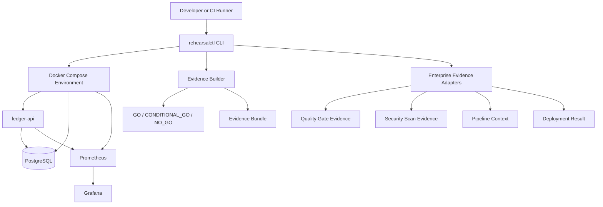

# Architecture

**Project:** Compose Release Assurance

**Document status:** Draft v0.1

**Architecture style:** Modular monolith reference implementation with adapter boundaries

## 1. Architectural Goal

Compose Release Assurance validates whether a Docker Compose-based stateful release is ready to proceed.

The system does not replace CI/CD platforms, security scanners, registries, deployment tools, or monitoring platforms. It collects and normalizes their relevant evidence, executes controlled rehearsal scenarios, validates runtime behavior and data integrity, then produces a conservative release decision.

The architecture prioritizes:

1. Security and confidentiality

2. Data integrity

3. Safe recovery

4. Observability

5. Maintainability

6. Reproducibility

7. Performance

## 2. System Context



## 3. Core Components

| Component             | Responsibility                                                                                | Must not own                                                     |

| --------------------- | --------------------------------------------------------------------------------------------- | ---------------------------------------------------------------- |

| `ledger-api`          | Provides a synthetic stateful transaction and ledger service                                  | Docker orchestration, release decisions, enterprise integrations |

| PostgreSQL            | Persists transfers, ledger entries, idempotency records, and audit records                    | Release orchestration or evidence generation                     |

| `rehearsalctl`        | Orchestrates rehearsals, validates results, collects evidence, and returns a release decision | Core ledger business rules                                       |

| Compose adapter       | Starts, stops, inspects, and validates the Docker Compose environment                         | Business validation logic                                        |

| Scenario runner       | Executes deterministic rehearsal scenarios                                                    | Evidence storage implementation                                  |

| Integrity validator   | Validates idempotency, duplicate prevention, ledger balance, and recovery correctness         | Docker command execution                                         |

| Evidence builder      | Produces normalized JSON, Markdown, checksum manifests, and future HTML reports               | Container lifecycle management                                   |

| Diagnostics collector | Captures container state, logs, resource summaries, network state, and runtime evidence       | Release-policy ownership                                         |

| Enterprise adapters   | Normalize input from pipelines, scanners, quality tools, registries, and deployment systems   | Direct coupling to domain logic                                  |

| Observability stack   | Collects and presents runtime metrics                                                         | Release decision logic                                           |

## 4. Deployment Model

The initial deployment target is Docker Compose.

The first environment contains:

```text

ledger-api

postgres

prometheus

grafana

```

Profiles will separate concerns:

```text

core            = ledger-api + postgres

observability   = prometheus + grafana

security        = optional local scan tooling

debug           = optional troubleshooting tools

```

The PostgreSQL service remains on an internal network by default. It must not expose a host port in release-oriented Compose configuration.

## 5. Rehearsal Flow

```text

1. Validate prerequisites and configuration.

2. Load pipeline, quality, security, and deployment evidence when available.

3. Start or validate the Compose environment.

4. Validate health and readiness.

5. Execute a smoke transaction.

6. Execute the selected rehearsal scenario.

7. Validate transaction and ledger invariants.

8. Collect metrics, logs, diagnostics, and runtime state.

9. Build an evidence bundle.

10. Apply release policy.

11. Return GO, CONDITIONAL_GO, or NO_GO with an explicit process exit code.

```

## 6. MVP Scenario: API Restart

The first end-to-end scenario is `api-restart`.

```text

1. Start the core stack.

2. Confirm API health and database readiness.

3. Submit a synthetic transfer with an idempotency key.

4. Restart the API container in a controlled manner.

5. Submit the same transfer with the same idempotency key.

6. Confirm no duplicate transfer exists.

7. Confirm ledger debit and credit entries remain balanced.

8. Record recovery duration and runtime evidence.

9. Produce a release decision and evidence bundle.

```

## 7. Data Integrity Model

The reference application uses synthetic data only.

Every successful transfer must create:

```text

Transfer record

Idempotency record

Debit ledger entry

Credit ledger entry

Audit record

```

Mandatory invariants:

```text

One idempotency key maps to one transfer.

No duplicate transfer may be created after retry.

Debit total equals credit total.

Every successful transfer has an audit record.

Any invariant failure produces NO_GO.

```

Database operations affecting these records must be transactional.

## 8. Dependency Direction

The dependency direction is intentionally strict:

```text

Domain rules

    ↑

Application services

    ↑

Ports / interfaces

    ↑

Infrastructure adapters

```

Examples:

* Ledger integrity rules must not directly call Docker.

* Release policy must not directly depend on Azure Pipelines, SonarQube, Fortify, Nexus, or Grafana.

* Enterprise integrations provide normalized input through adapters.

* Docker Compose interactions remain isolated behind an orchestration boundary.

## 9. Evidence Contracts

The core system consumes and produces vendor-neutral files.

Examples:

```text

pipeline-context.json

quality-gate.json

security-findings.json

grype-report.json

deployment-result.json

runtime-health.json

scenario-results.json

integrity-report.json

report.json

summary.md

checksums.sha256

```

This keeps the framework compatible with Azure Pipelines, Jenkins, SonarQube, Fortify, Nexus-compatible registries, Ansible, Prometheus, Grafana, and future adapters without embedding vendor-specific logic in the core.

## 10. Trust Boundaries

| Boundary                                   | Risk                                          | Control                                                     |

| ------------------------------------------ | --------------------------------------------- | ----------------------------------------------------------- |

| Developer or CI runner to Docker Engine    | High-privilege container control              | Run `rehearsalctl` on an authorized host or runner only     |

| Host to Compose network                    | Service exposure and network misconfiguration | Internal networks, explicit ports, health checks            |

| CLI to evidence inputs                     | Tampered or malformed reports                 | Schema validation, checksums, explicit provenance fields    |

| Application to PostgreSQL                  | Data corruption or duplicate writes           | Transactions, constraints, idempotency, integrity checks    |

| Repository to public GitHub                | Secret or internal-data exposure              | `.gitignore`, secret scanning, synthetic data only          |

| CI system to registry or deployment target | Credential misuse                             | Secret variables, least privilege, no committed credentials |

## 11. Failure Semantics

The framework fails closed for mandatory requirements.

Examples:

```text

Health check fails                  -> NO_GO

Readiness check fails               -> NO_GO

Evidence is missing                 -> NO_GO

Duplicate transaction exists        -> NO_GO

Ledger balance is invalid           -> NO_GO

Security finding exceeds policy     -> NO_GO

Optional adapter unavailable        -> CONDITIONAL_GO or documented skip

```

No mandatory validation may silently pass after an error.

## 12. Planned Repository Structure

```text

apps/

  ledger-api/

platform/

  rehearsalctl/

infra/

  compose/

ansible/

observability/

policies/

scenarios/

scripts/

tests/

docs/

  adr/

artifacts/

```

## 13. Deferred Decisions

The following decisions are intentionally deferred until the MVP is working:

* CLI framework selection

* ORM and migration tooling selection

* Exact metric names and dashboard layout

* HTML report rendering implementation

* Local registry versus Docker Hub demo flow

* Azure Pipelines and Jenkins adapter depth

* Fortify, SonarQube, Nexus, Dynatrace, Zabbix, SolarWinds, and Nessus integration depth

* Terraform provisioning module

* Advanced network-fault tooling
